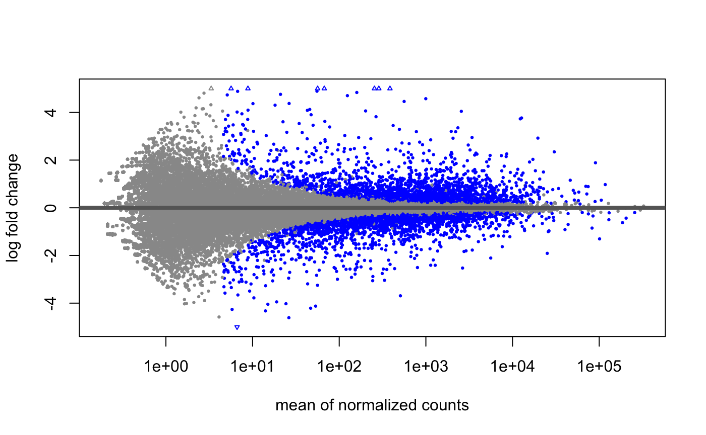
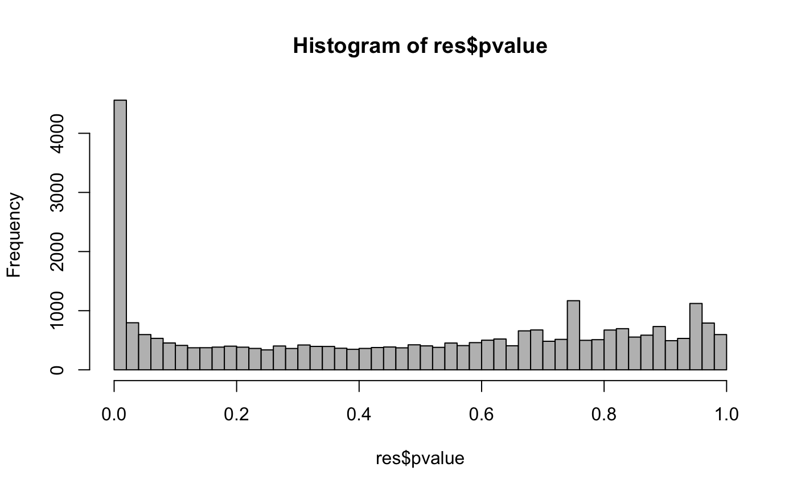
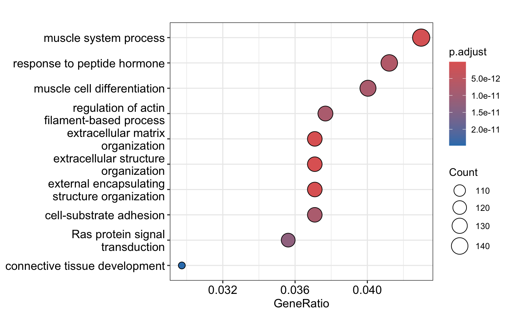
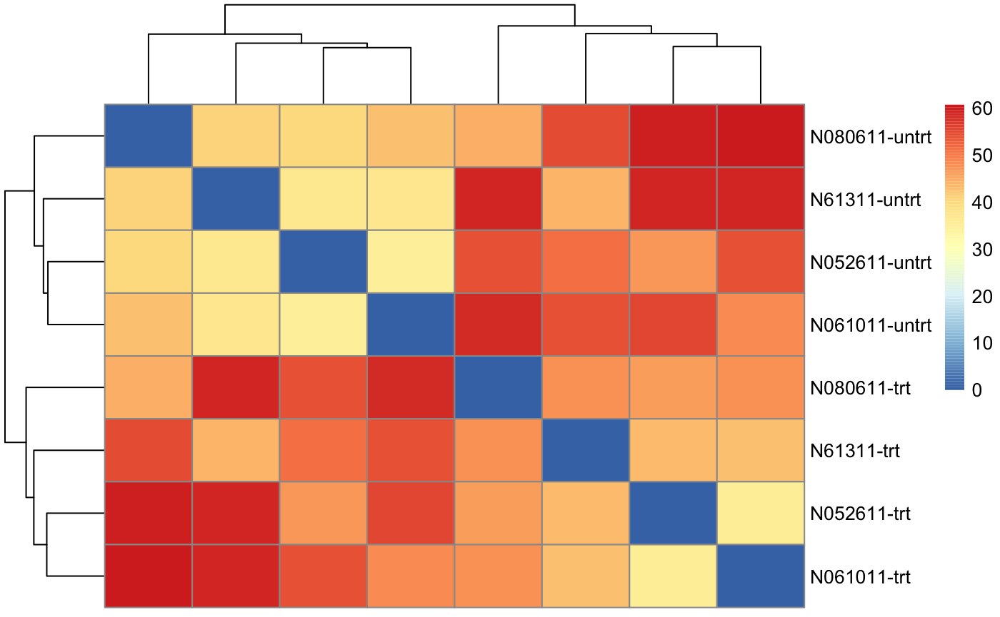
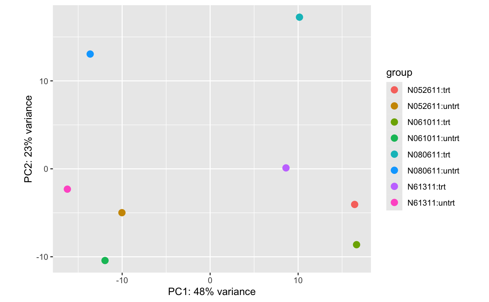

## Introduction

DESeq2 is a popular R package used for analyzing count data from RNA
sequencing (RNA-seq) experiments. It is designed to perform differential
gene expression analysis, helping researchers identify genes that are
differentially expressed across different conditions.

In this tutorial, we will cover the following topics:

-   Installation and loading of DESeq2
-   Input data preparation
-   Running the DESeq2 pipeline
-   Exploring the results
-   Visualization

## Installation and Loading

First, we need to install and load the DESeq2 package. DESeq2 is
available from Bioconductor, so we use `BiocManager` to install it.

``` r
if (!requireNamespace("BiocManager", quietly = TRUE))
    install.packages("BiocManager")
BiocManager::install("DESeq2")
```

Now, load the DESeq2 package.

``` r
library(DESeq2)
```

    ## Warning: package 'DESeq2' was built under R version 4.3.3

    ## Loading required package: S4Vectors

    ## Warning: package 'S4Vectors' was built under R version 4.3.2

    ## Loading required package: stats4

    ## Loading required package: BiocGenerics

    ## Warning: package 'BiocGenerics' was built under R version 4.3.1

    ## 
    ## Attaching package: 'BiocGenerics'

    ## The following objects are masked from 'package:stats':
    ## 
    ##     IQR, mad, sd, var, xtabs

    ## The following objects are masked from 'package:base':
    ## 
    ##     anyDuplicated, aperm, append, as.data.frame, basename, cbind,
    ##     colnames, dirname, do.call, duplicated, eval, evalq, Filter, Find,
    ##     get, grep, grepl, intersect, is.unsorted, lapply, Map, mapply,
    ##     match, mget, order, paste, pmax, pmax.int, pmin, pmin.int,
    ##     Position, rank, rbind, Reduce, rownames, sapply, setdiff, sort,
    ##     table, tapply, union, unique, unsplit, which.max, which.min

    ## 
    ## Attaching package: 'S4Vectors'

    ## The following object is masked from 'package:utils':
    ## 
    ##     findMatches

    ## The following objects are masked from 'package:base':
    ## 
    ##     expand.grid, I, unname

    ## Loading required package: IRanges

    ## Warning: package 'IRanges' was built under R version 4.3.1

    ## Loading required package: GenomicRanges

    ## Warning: package 'GenomicRanges' was built under R version 4.3.1

    ## Loading required package: GenomeInfoDb

    ## Warning: package 'GenomeInfoDb' was built under R version 4.3.3

    ## Loading required package: SummarizedExperiment

    ## Warning: package 'SummarizedExperiment' was built under R version 4.3.1

    ## Loading required package: MatrixGenerics

    ## Warning: package 'MatrixGenerics' was built under R version 4.3.1

    ## Loading required package: matrixStats

    ## Warning: package 'matrixStats' was built under R version 4.3.2

    ## 
    ## Attaching package: 'MatrixGenerics'

    ## The following objects are masked from 'package:matrixStats':
    ## 
    ##     colAlls, colAnyNAs, colAnys, colAvgsPerRowSet, colCollapse,
    ##     colCounts, colCummaxs, colCummins, colCumprods, colCumsums,
    ##     colDiffs, colIQRDiffs, colIQRs, colLogSumExps, colMadDiffs,
    ##     colMads, colMaxs, colMeans2, colMedians, colMins, colOrderStats,
    ##     colProds, colQuantiles, colRanges, colRanks, colSdDiffs, colSds,
    ##     colSums2, colTabulates, colVarDiffs, colVars, colWeightedMads,
    ##     colWeightedMeans, colWeightedMedians, colWeightedSds,
    ##     colWeightedVars, rowAlls, rowAnyNAs, rowAnys, rowAvgsPerColSet,
    ##     rowCollapse, rowCounts, rowCummaxs, rowCummins, rowCumprods,
    ##     rowCumsums, rowDiffs, rowIQRDiffs, rowIQRs, rowLogSumExps,
    ##     rowMadDiffs, rowMads, rowMaxs, rowMeans2, rowMedians, rowMins,
    ##     rowOrderStats, rowProds, rowQuantiles, rowRanges, rowRanks,
    ##     rowSdDiffs, rowSds, rowSums2, rowTabulates, rowVarDiffs, rowVars,
    ##     rowWeightedMads, rowWeightedMeans, rowWeightedMedians,
    ##     rowWeightedSds, rowWeightedVars

    ## Loading required package: Biobase

    ## Warning: package 'Biobase' was built under R version 4.3.1

    ## Welcome to Bioconductor
    ## 
    ##     Vignettes contain introductory material; view with
    ##     'browseVignettes()'. To cite Bioconductor, see
    ##     'citation("Biobase")', and for packages 'citation("pkgname")'.

    ## 
    ## Attaching package: 'Biobase'

    ## The following object is masked from 'package:MatrixGenerics':
    ## 
    ##     rowMedians

    ## The following objects are masked from 'package:matrixStats':
    ## 
    ##     anyMissing, rowMedians

## Input Data Preparation

DESeq2 requires a count matrix and sample information. The count matrix
should contain raw counts of reads mapped to each gene for each sample.
Sample information should include metadata about each sample, such as
condition or treatment.

### Example Data

For this tutorial, we will use an example dataset provided by the airway
package. Note that you may get installation messages similar to those
below.

``` r
if (!require("BiocManager", quietly = TRUE))
    install.packages("BiocManager")
```

    ## Warning: package 'BiocManager' was built under R version 4.3.2

    ## Bioconductor version '3.18' is out-of-date; the current release version '3.19'
    ##   is available with R version '4.4'; see https://bioconductor.org/install

``` r
BiocManager::install("airway")
```

    ## Bioconductor version 3.18 (BiocManager 1.30.23), R 4.3.0 (2023-04-21)

    ## Warning: package(s) not installed when version(s) same as or greater than current; use
    ##   `force = TRUE` to re-install: 'airway'

    ## Old packages: 'hardhat', 'reticulate'

``` r
library(airway)
data(airway)
airway <- as(airway, "RangedSummarizedExperiment")
```

Inspect the count data and sample information.

``` r
head(assay(airway))
```

    ##                 SRR1039508 SRR1039509 SRR1039512 SRR1039513 SRR1039516
    ## ENSG00000000003        679        448        873        408       1138
    ## ENSG00000000005          0          0          0          0          0
    ## ENSG00000000419        467        515        621        365        587
    ## ENSG00000000457        260        211        263        164        245
    ## ENSG00000000460         60         55         40         35         78
    ## ENSG00000000938          0          0          2          0          1
    ##                 SRR1039517 SRR1039520 SRR1039521
    ## ENSG00000000003       1047        770        572
    ## ENSG00000000005          0          0          0
    ## ENSG00000000419        799        417        508
    ## ENSG00000000457        331        233        229
    ## ENSG00000000460         63         76         60
    ## ENSG00000000938          0          0          0

``` r
colData(airway)
```

    ## DataFrame with 8 rows and 9 columns
    ##            SampleName     cell      dex    albut        Run avgLength
    ##              <factor> <factor> <factor> <factor>   <factor> <integer>
    ## SRR1039508 GSM1275862  N61311     untrt    untrt SRR1039508       126
    ## SRR1039509 GSM1275863  N61311     trt      untrt SRR1039509       126
    ## SRR1039512 GSM1275866  N052611    untrt    untrt SRR1039512       126
    ## SRR1039513 GSM1275867  N052611    trt      untrt SRR1039513        87
    ## SRR1039516 GSM1275870  N080611    untrt    untrt SRR1039516       120
    ## SRR1039517 GSM1275871  N080611    trt      untrt SRR1039517       126
    ## SRR1039520 GSM1275874  N061011    untrt    untrt SRR1039520       101
    ## SRR1039521 GSM1275875  N061011    trt      untrt SRR1039521        98
    ##            Experiment    Sample    BioSample
    ##              <factor>  <factor>     <factor>
    ## SRR1039508  SRX384345 SRS508568 SAMN02422669
    ## SRR1039509  SRX384346 SRS508567 SAMN02422675
    ## SRR1039512  SRX384349 SRS508571 SAMN02422678
    ## SRR1039513  SRX384350 SRS508572 SAMN02422670
    ## SRR1039516  SRX384353 SRS508575 SAMN02422682
    ## SRR1039517  SRX384354 SRS508576 SAMN02422673
    ## SRR1039520  SRX384357 SRS508579 SAMN02422683
    ## SRR1039521  SRX384358 SRS508580 SAMN02422677

## DESeq2 Pipeline

### Creating a DESeqDataSet

The first step is to create a `DESeqDataSet` object from the count
matrix and sample information. Note that you may see messages similar to
those below.

``` r
if (!require("BiocManager", quietly = TRUE))
    install.packages("BiocManager")

BiocManager::install("DESeq2")
```

    ## Bioconductor version 3.18 (BiocManager 1.30.23), R 4.3.0 (2023-04-21)

    ## Warning: package(s) not installed when version(s) same as or greater than current; use
    ##   `force = TRUE` to re-install: 'DESeq2'

    ## Old packages: 'hardhat', 'reticulate'

``` r
library(DESeq2)
dds <- DESeqDataSet(airway, design = ~ cell + dex)
```

### Pre-filtering

To speed up computation, we can pre-filter the dataset to remove rows
with low counts. In this case we are removing those with counts of less
than 1.

``` r
dds <- dds[rowSums(counts(dds)) > 1,]
```

### Running the DESeq Function

Now, we run the DESeq function, which will perform the differential
expression analysis.

``` r
dds <- DESeq(dds)
```

    ## estimating size factors

    ## estimating dispersions

    ## gene-wise dispersion estimates

    ## mean-dispersion relationship

    ## final dispersion estimates

    ## fitting model and testing

### Results

We can extract the results for a specific contrast using the `results`
function. For example, let’s extract the results for the dex treatment
effect. “trt” indicates the ones that the dex treatment was applied to,
while “untrt” indicates the ones that the dex treatment was not applied
to.

``` r
res <- results(dds, contrast = c("dex", "trt", "untrt"))
head(res)
```

    ## log2 fold change (MLE): dex trt vs untrt 
    ## Wald test p-value: dex trt vs untrt 
    ## DataFrame with 6 rows and 6 columns
    ##                    baseMean log2FoldChange     lfcSE      stat      pvalue
    ##                   <numeric>      <numeric> <numeric> <numeric>   <numeric>
    ## ENSG00000000003  708.602170     -0.3812540 0.1006544 -3.787752 1.52016e-04
    ## ENSG00000000419  520.297901      0.2068126 0.1122186  1.842943 6.53373e-02
    ## ENSG00000000457  237.163037      0.0379204 0.1434447  0.264356 7.91506e-01
    ## ENSG00000000460   57.932633     -0.0881682 0.2871418 -0.307054 7.58802e-01
    ## ENSG00000000938    0.318098     -1.3782270 3.4998728 -0.393793 6.93734e-01
    ## ENSG00000000971 5817.352868      0.4264021 0.0883134  4.828284 1.37715e-06
    ##                        padj
    ##                   <numeric>
    ## ENSG00000000003 1.28121e-03
    ## ENSG00000000419 1.96208e-01
    ## ENSG00000000457 9.11196e-01
    ## ENSG00000000460 8.94633e-01
    ## ENSG00000000938          NA
    ## ENSG00000000971 1.81808e-05

### Summary

To get a summary of the results, use the `summary` function.

``` r
summary(res)
```

    ## 
    ## out of 29391 with nonzero total read count
    ## adjusted p-value < 0.1
    ## LFC > 0 (up)       : 2607, 8.9%
    ## LFC < 0 (down)     : 2218, 7.5%
    ## outliers [1]       : 0, 0%
    ## low counts [2]     : 11397, 39%
    ## (mean count < 5)
    ## [1] see 'cooksCutoff' argument of ?results
    ## [2] see 'independentFiltering' argument of ?results

## Exploring the Results

### MA-Plot

An MA-plot shows the log fold changes attributable to a given variable
over the mean of normalized counts.

``` r
plotMA(res, ylim = c(-5, 5))
```



### Histogram of p-values

We can plot a histogram of the p-values to check the distribution. Note
that you can modify the breaks variable to change how many bins there
are.

``` r
hist(res$pvalue, breaks = 50, col = "grey")
```



### Gene Ontology Enrichment

DESeq2 results can be used for downstream analysis such as Gene Ontology
(GO) enrichment. In this case, we are using the clusterProfiler library
to run GO enrichment analysis.

``` r
# Example of running GO enrichment analysis
if (!require("BiocManager", quietly = TRUE))
    install.packages("BiocManager")

BiocManager::install("clusterProfiler")
BiocManager::install("org.Hs.eg.db")
library(clusterProfiler)
library(org.Hs.eg.db)
gene_list <- rownames(res)[which(res$padj < 0.05)]
ego <- enrichGO(gene = gene_list, OrgDb = org.Hs.eg.db, keyType = "ENSEMBL", ont = "BP")
dotplot(ego)
```

## Visualization

### Heatmap of Sample Distances

We can visualize the distances between samples using a heatmap.

``` r
library(pheatmap)
vsd <- vst(dds, blind = FALSE)
sampleDists <- dist(t(assay(vsd)))
sampleDistMatrix <- as.matrix(sampleDists)
rownames(sampleDistMatrix) <- paste(vsd$cell, vsd$dex, sep = "-")
colnames(sampleDistMatrix) <- NULL
pheatmap(sampleDistMatrix, clustering_distance_rows = sampleDists, clustering_distance_cols = sampleDists)
```



### PCA Plot

Principal Component Analysis (PCA) can help visualize the overall effect
of experimental covariates.

``` r
plotPCA(vsd, intgroup = c("cell", "dex"))
```

    ## using ntop=500 top features by variance



## Conclusion

In this tutorial, we covered the basic workflow of DESeq2 for
differential expression analysis of RNA-seq data. We went through data
preparation, running the DESeq2 pipeline, exploring the results, and
visualization. DESeq2 is a powerful tool for RNA-seq analysis, providing
robust methods to identify differentially expressed genes.

For more detailed information and advanced usage, refer to the [DESeq2
vignette](https://www.bioconductor.org/packages/release/bioc/vignettes/DESeq2/inst/doc/DESeq2.html).

\`\`\`

This R Markdown file provides a comprehensive lesson on using the DESeq2
package for differential gene expression analysis. The lesson includes
installation steps, data preparation, running the DESeq2 pipeline, and
visualizing the results. You can customize it further based on your
specific teaching needs.
